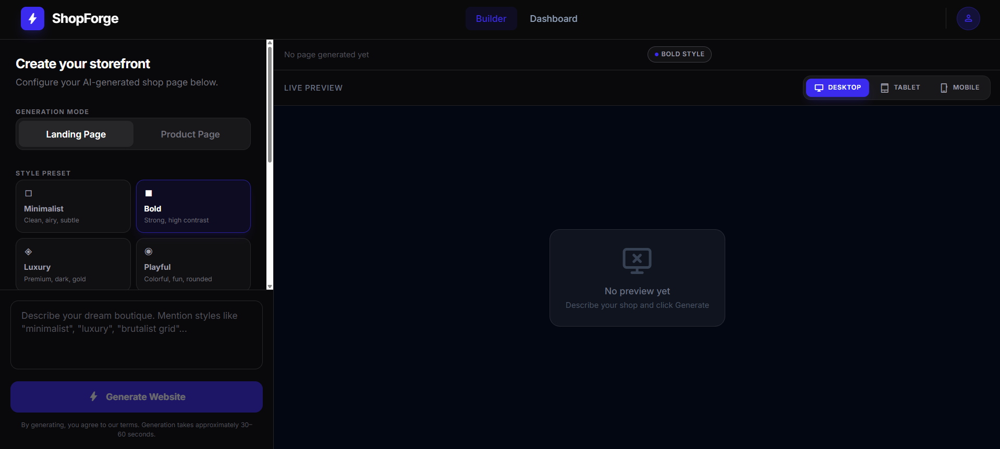
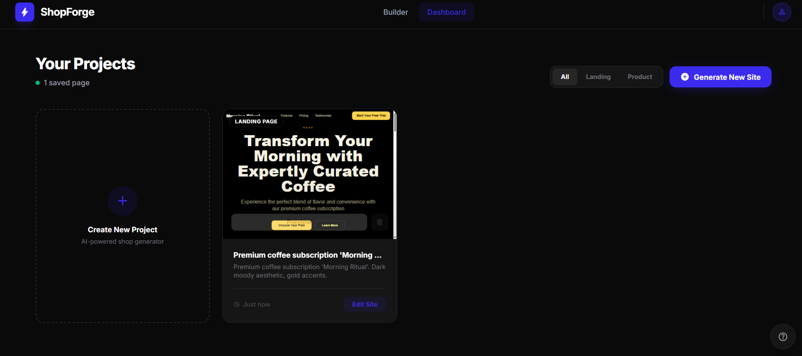

# ShopForge — AI Storefront Builder

Describe your shop in plain English, pick a page type, and get a production-ready storefront in seconds.

---

## What is this?

ShopForge is an AI-powered tool that lets you generate complete e-commerce pages just by describing what you want. You type something like *"a premium coffee subscription brand called Morning Ritual, dark moody aesthetic with gold accents"* and it spits out a full landing page with hero, features, pricing, testimonials — everything.

Built this as part of an intern assignment. The goal was to build a working AI → preview → export flow that feels like a real product, not a demo.

---

## Features

**Core**
- Generate landing pages or product pages from a text description
- Live preview in an iframe sandbox (React + Tailwind, rendered in the browser)
- Iterative refinements — just say "make the hero bigger" or "switch to dark mode"
- 4 style presets: Minimalist, Bold, Luxury, Playful — each generates visually distinct output
- Device preview toggle (Desktop / Tablet / Mobile)

**Export**
- Download as a self-contained HTML file
- Download as a full Next.js project ZIP (ready to `npm install && npm run dev`)
- Code viewer with syntax highlighting

**Extra stuff**
- Save pages to a dashboard (localStorage)
- Version history — every refinement is saved, you can restore old versions
- Generate 3 design variants at once and pick your favourite
- Component library sidebar — drag sections like FAQ, Stats, Team onto the preview
- One-click Vercel deploy (needs your own VERCEL_DEPLOY_TOKEN)
- Share pages via a share link

---

## Tech Stack

- **Next.js 14** (App Router)
- **TypeScript**
- **Tailwind CSS**
- **Claude API** (claude-sonnet) — primary AI provider
- Also supports OpenAI, Gemini, Groq via env flag
- `react-syntax-highlighter` for code display
- `jszip` for ZIP export

---

## Getting Started

```bash
git clone https://github.com/yourusername/shopforge
cd shopforge
npm install
```

Create a `.env.local` file:

```env
# Required — pick one
ANTHROPIC_API_KEY=your_key_here

# Optional — switch AI provider
AI_PROVIDER=anthropic   # or openai, gemini, groq

# Optional — only needed for Vercel deploy feature
VERCEL_DEPLOY_TOKEN=your_vercel_token
```

Then:

```bash
npm run dev
```

Open [http://localhost:3000](http://localhost:3000).

---

## How to use it

1. Pick **Landing Page** or **Product Page** from the toggle
2. Choose a style preset (Bold is the default, looks good for most things)
3. Optionally paste a reference URL for design inspiration
4. Describe your shop and hit Generate
5. Once it loads, you can keep refining it by typing follow-up messages
6. Hit **Save** to store it in your dashboard, or **Download** to export the code

For the component library — click the **Components** button in the toolbar, then drag any section card onto the preview. The AI will blend it into your existing design.

---

## Project Structure

```
src/
├── app/
│   ├── page.tsx              # Main builder UI
│   ├── dashboard/page.tsx    # Saved pages
│   ├── share/[id]/page.tsx   # Shareable page viewer
│   └── api/
│       ├── generate/         # Main generation endpoint
│       ├── variants/         # 3-variant generation
│       ├── insert-section/   # Component library drag-drop
│       └── deploy/           # Vercel deployment
├── components/               # UI components
├── lib/
│   ├── pageBuilder.ts        # JSON pageData → React JSX
│   ├── prompts.ts            # System prompts + message formatting
│   ├── storage.ts            # localStorage helpers
│   └── claude.ts             # AI provider clients
├── shells/                   # Shell components (used in ZIP export)
└── types/index.ts            # All TypeScript interfaces
```

---

## Design Decisions

**Why JSON as the intermediate format?**
The AI generates structured JSON (`GeneratedPageData`) instead of raw React code. This makes refinements, section merges, and preset switching way more reliable. Raw code generation is unpredictable — JSON is structured and diffable.

**Why inline JSX in pageBuilder instead of importing shell components?**
The live preview runs in a sandboxed iframe using Babel standalone. It can't import modules. So `pageBuilder.ts` builds a self-contained `function App()` with all the JSX inlined. The shell components in `src/shells/` are used for the ZIP export's `App.jsx`.

**Why not use Sandpack?**
Tried it. Too heavy and had issues with the Tailwind CDN inside it. The current iframe approach with `srcDoc` + Babel standalone works well and is much simpler.

**Multi-provider support**
Set `AI_PROVIDER=groq` in your env to use Llama 3.3 70B which is free and fast. Quality isn't as good as Claude for complex layouts but works fine for simple pages.

---

## Known Limitations

- Share links only work in the same browser (data is in localStorage, not a server)
- localStorage will fill up after ~20-30 saved pages (eviction happens automatically but older pages get dropped)
- The Vercel deploy feature needs a token with deployment permissions — get one at vercel.com/account/tokens
- Image generation uses loremflickr.com which is free but occasionally slow

---

## What I'd improve with more time

- Real backend/database for saves and sharing (Supabase would be the obvious choice)
- Streaming the AI generation so you see the page build progressively
- Better mobile layout for the builder itself (the sidebar + preview layout doesn't work great on small screens)
- Actually scrape/screenshot reference URLs instead of just passing them as text
- More section types in the component library

---


## Screenshots

| Builder | Dashboard | Variants |
|---------|-----------|----------|
|  |  |  |

---
